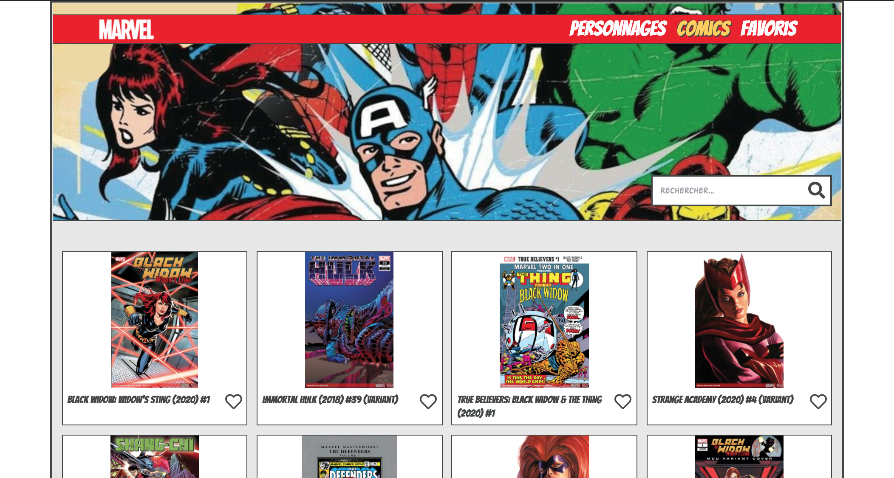

<h1 align="center">MARVEL FRONT END  🦸‍♀️ 🦸 🦸‍♂️</h1>


<br/>
<!--<p align="center"><a href="https://naviga-thor.netlify.app/">See the project</a></p>-->

## Installation

1. Clone the repo

3. Install NPM packages
   ```sh
   yarn
   ```
   
3. Run the project
    ```JS
    yarn start
    ```
    
4. Enjoy 🎇
    ```JS
    http://localhost:3000/
    ```
